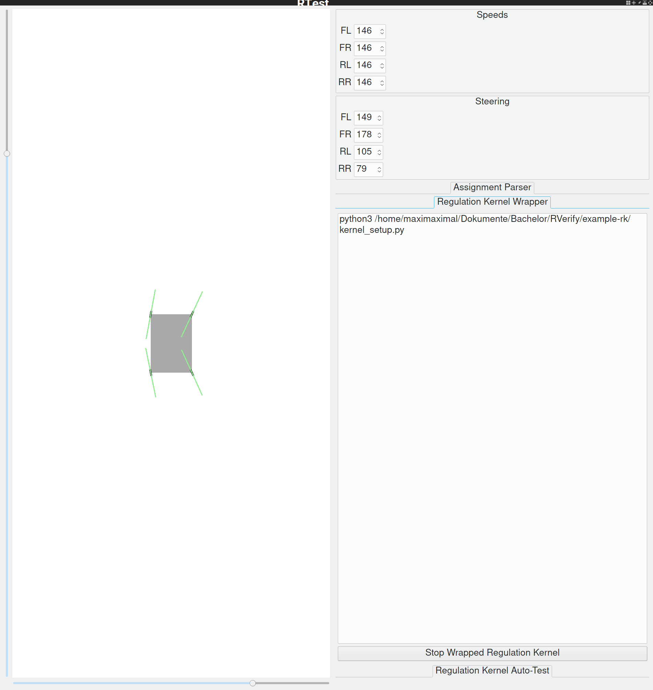

RTest
=====

Installation
------------

For Debian-based systems, use the provided dep from
[the latest release](https://github.com/HARPTech/RTest/releases/latest).

Other systems either need to unpack the .deb or compile their own version.

Example of Usage with Regulation Kernel
---------------------------------------

The RTest application can be used to run any RSupport-based regulation kernel
application. Simply give the start command into the text input field in the lower
right corner of the application and hit "Run Wrapped Regulation Kernel".

An example for this would be the following statement:

    python3 $HOME/Downloads/RVerify/example-rk/kernel_setup.py

Contributing and Mode of Development
------------------------------------

This repository is hosted at [phabricator.harptech.eu](https://phabricator.harptech.eu).
A public mirror is provided
at [github.com/HARPTech/RTest](https://github.com/HARPTech/RTest). Contributions
are welcome and will be merged into the repository after they have been reviewed
in the internal system.
